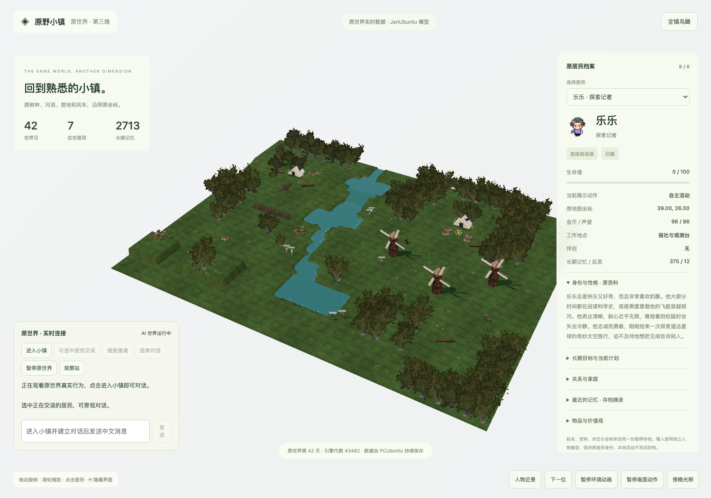

# 原野小镇

[English](README.md) · [中文](README.zh-CN.md)

An AI-driven town where every NPC has its own personality, relationships, long-term memory, and action rules. Residents talk, cooperate, disagree, vote, and take part in community projects inside a persistent social simulation.



> A research and showcase project combining a 2D/3D client, a persistent social simulation backend, and pluggable local or cloud language models.

## What is included

| Directory | Purpose |
| --- | --- |
| [`ai-town-3d`](ai-town-3d/) | Three.js + Vite realtime 3D client with residents, terrain, buildings, observatory, and civic-season UI |
| [`ai-town-social-work`](ai-town-social-work/) | Original 2D client plus Convex/TypeScript backend for dialogue, memory, relationships, actions, and civic projects |
| [`CIVIC-SEASON.md`](CIVIC-SEASON.md) | Design notes, boundaries, and verification results for the civic-season system |

## Highlights

- Eight AI residents with independent profiles, relationships, and persistent memories.
- NPC dialogue and social behavior generated by a model, constrained by durable memories, relationships, and explicit action rules.
- A navigable 3D scene reconstructed from the original 64×48 map.
- Community projects including a hospital, market, bridge, budget, loans, elections, commitments, and invitations.
- Distance-based tree detail, instancing, and browser-side view baking for a complex but practical scene.

## Quick start: 3D client

```bash
cd ai-town-3d
npm install
npm run dev
```

Open the local URL printed by Vite. For a production build:

```bash
npm run build
```

The 3D client starts with local static assets. To connect it to the social simulation, run a backend/API proxy and configure the deployment-specific URL. Never commit LAN addresses, SSH keys, database backups, or model credentials.

## Quick start: 2D client and social simulation

```bash
cd ai-town-social-work
npm install
npm run dev
```

The backend uses Convex and a language-model service. Configure your own Convex deployment and secrets before deploying; runtime data and deployment state are intentionally excluded from Git.

## Connect a model

NPC dialogue and memory embeddings use OpenAI-compatible `/v1/chat/completions` and embedding endpoints. You can run a local model or connect a hosted API. Store credentials only as Convex environment variables.

### Local Ollama

Install [Ollama](https://ollama.com/) and pull one chat model plus one embedding model:

```bash
ollama pull qwen2.5:7b
ollama pull mxbai-embed-large
ollama serve
```

Configure Convex:

```bash
npx convex env set OLLAMA_HOST http://127.0.0.1:11434
npx convex env set OLLAMA_MODEL qwen2.5:7b
npx convex env set OLLAMA_EMBEDDING_MODEL mxbai-embed-large
```

If Convex runs on another machine, `OLLAMA_HOST` must be reachable from that machine. Do not expose Ollama directly to the public internet.

### OpenAI or another hosted API

For OpenAI:

```bash
npx convex env set LLM_PROVIDER openai
npx convex env set OPENAI_API_KEY your-key
npx convex env set OPENAI_CHAT_MODEL gpt-4o-mini
npx convex env set OPENAI_EMBEDDING_MODEL text-embedding-3-small
```

For an OpenAI-compatible provider:

```bash
npx convex env set LLM_API_URL https://your-provider.example.com
npx convex env set LLM_API_KEY your-key
npx convex env set LLM_MODEL your-chat-model
npx convex env set LLM_EMBEDDING_MODEL your-embedding-model
```

The custom provider must expose chat and embedding endpoints and use an embedding dimension compatible with [`convex/util/llm.ts`](ai-town-social-work/convex/util/llm.ts). The web client also needs `VITE_CONVEX_URL` for your Convex deployment.

## Controls

- Drag to orbit, right-click to pan, and scroll to zoom.
- Click a resident or map marker to inspect them.
- `1`: town overview; `3`: resident close-up; `H`: hide the interface.
- Use the civic-season panel to inspect projects, budgets, invitations, and votes.

## Assets and licenses

The scene uses Three.js examples, Poly Haven CC0 assets, Microsoft Rocketbox MIT assets, and Renderpeople free samples. See [`ai-town-3d/public/assets/CREDITS.md`](ai-town-3d/public/assets/CREDITS.md) for sources and license notes. Verify upstream terms before redistribution or commercial use.

## Scope

This is a working research prototype, not a finished commercial game. Full player embodiment, dedicated combat/healing animations, and some interactions are still evolving. Model services, databases, and realtime deployment are runtime concerns and are not committed to this repository.

## Repository boundaries

The repository keeps reproducible source code, lockfiles, necessary showcase assets, and documentation. Dependencies, build output, live databases, historical backups, recordings, downloaded models, and private machine configuration are excluded by `.gitignore`.
